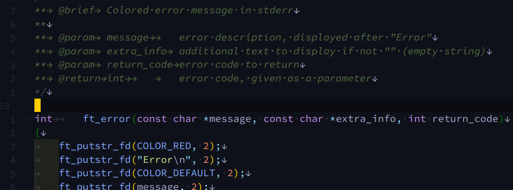

# Как быстро и легко писать полезные комментарии
## Которые радуют глаз и уважает даже норма
Наподобие таких:


### Зачем?
Чтобы намного быстрее разбираться в собственном коде.
Если никогда раньше не писали комментарии к функциям, попробуйте хотя бы на недельку. Вдруг понравится :-)

### Но норма...
Да, школьный кодстайл нам и здесь вставляет палки в колёса. И нормальные комментарии Doxygen она нам писать не даст. Но можно устроить что-то похожее (хоть и не умеющее автоматически генерить документацию во всяких там html и pdf с красивыми графиками).

### Нам понадобятся
Vscode. Если есть желающие дополнить гайд информацией по vim и clion - велкам. Если вы крутой хакер, умеющий в git, то можно сразу пул реквестом.

[Плагин Doxygen Documentation Generator] (https://marketplace.visualstudio.com/items?itemName=cschlosser.doxdocgen) для полуавтоматического добавления комментариев.

[Плагин Better Comments] (https://marketplace.visualstudio.com/items?itemName=aaron-bond.better-comments) (опционально) если хочется раскрасить этот блок каким-то другим цветом (на картинке это тёмно-зелёный вместо стандартного бледно-серого)

### Как это работает
С плагином DDG нам достаточно поставить курсор на строчку перед функцией и набрать
`/**`
(стандартное начало для Doxygen комментариев) и нажать Enter. Перед нами предстанет заготовка комментария, где уже будут прописаны наши параметры и иногда стандартный текст в описании (напр. для геттеров/сеттеров).

### Настройка
Всё это добро можно настраивать как в настройках расширения, так и напрямую в settings.json.
Вот пример настроек в settings.json (можете скопировать эти строчки себе в конфиг):
```javascript
    "doxdocgen.c.firstLine": "/*",
    "doxdocgen.c.lastLine": "*/\n",
    "doxdocgen.c.commentPrefix": "**\t",
    "doxdocgen.generic.paramTemplate": "@param\t{param}\t\tDOC",
    "doxdocgen.generic.returnTemplate": "@return\t{type}\tDOC",
    "doxdocgen.generic.briefTemplate": "@brief\t{text}",
```
Чтобы норма не ругалась мы изменяем символы начала комментария, добавляем пустую строчку в конце и изменяем символы строки комментария. Остальное - это выравнивание для разных элементов шаблона. Табами выравнивать удобнее и это выглядит чище, если вы включаете показ спецсимволов (пробелов и табов). Есть ещё встроенный механизм выравнивания, но не такой удобный и использующий пробелы.

### Опциональное раскрашивание
С одной стороны мы хотим чтобы эти комментарии были более заметны, чем стандартные комментарии. С другой - чтобы не сильно бросали в глаза, отвлекая на себя внимание.
Вот так выглядит кусочек конфига, который за это отвечает:
```javascript
      {
        "tag": "**",
        "color": "#557042",
        "strikethrough": false,
        "underline": false,
        "backgroundColor": "transparent",
        "bold": false,
        "italic": false
      },
```   
Поместить в блок better-comments.tags. Этот блок говорит редактору, что когда он видит строку, начинающуюся с `**` то её надо оформить соответствующим образом. Меняете цвет под себя и радуетесь жизни.

### PS: Тема c картинки
[Material Theme (blue)] (https://marketplace.visualstudio.com/items?itemName=Equinusocio.vsc-material-theme)

### Контакты
Вопросы, замечания и комментарии можете отправлять в телеграм @Sky18
